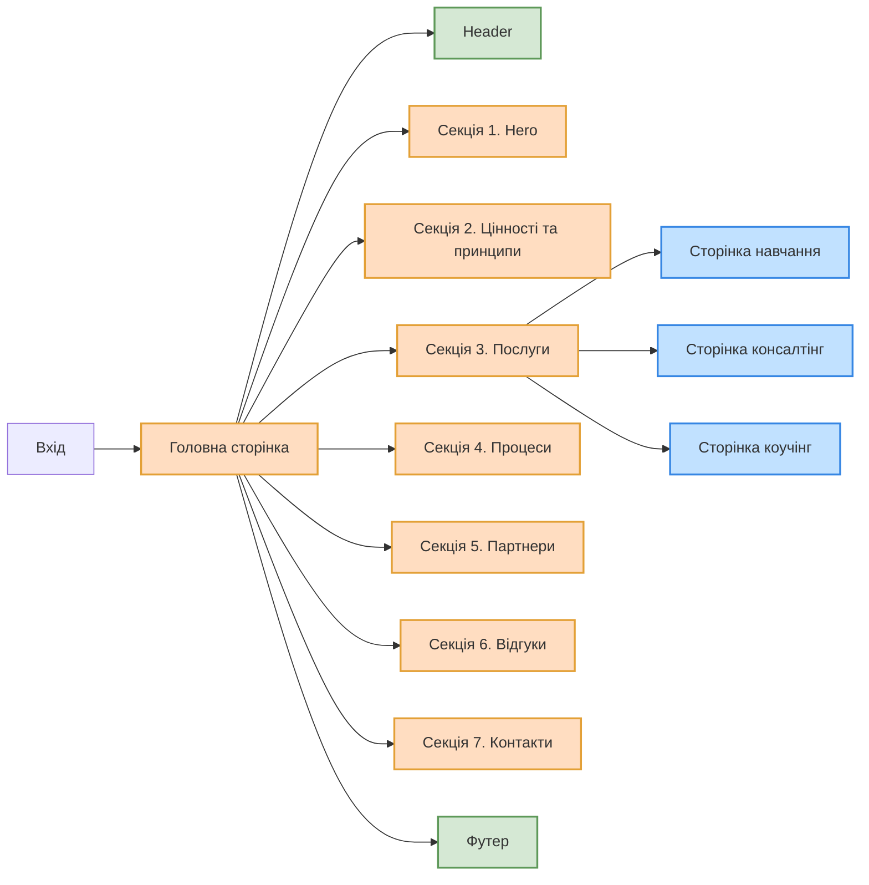

# Проєкт IM CONSULTING

## Опис проєкту

Сайт-візитка для створення особистого бренду та залучення нових клієнтів та партнерів.

- **Назва проєкту**: IM CONSULTING
- **Замовник проєкту**: Ілля Мушковський, бізнес тренер, топ консультант, антикризовий менеджер, коуч.

## Мета проєкту

- Створення позитивного іміджу особистого бренду.
- Інформування клієнтів.
- Залучення клієнтів / партнерів.
- Отримання зворотного зв'язку від клієнтів.

## Цільова аудиторія

- **Вікова категорія**: Від 20 до 65.
- **Рівень доходів**: Середній, високий.

## Обсяг продукту

Багатосторінковий сайт-візитка для створення позитивного іміджу особистого бренду, інформування клієнтів, залучення клієнтів / партнерів та отримання зворотного зв'язку від клієнтів.

## Технічний стек

**Front-end:**

- Next.js
- CSS framework: Tailwind

## Доступність

- Інтуїтивно зрозумілий дизайн.
- Зручний для мобільних пристроїв.
- Веб-ресурс доступний для будь-якого підключення до Інтернету.

## Мови, що підтримуються

- Українська

## Структура сайту

## Розгортання (Deploying)

Для розгортання цього проєкту вам потрібно виконати наступні кроки:

Клонуйте репозиторій: Використовуйте команду git clone для клонування цього репозиторію на ваш комп'ютер.

Встановіть залежності: Відкрийте термінал у кореневій папці проєкту та виконайте команду npm install або yarn install, щоб встановити всі необхідні залежності.

Налаштування змінних середовища: Створіть файл .env.local у кореневій папці та додайте необхідні змінні середовища, які вам потрібні для проєкту.

Запустіть додаток: Виконайте команду npm run dev або yarn dev, щоб запустити проєкт на локальному сервері.

Розгортання: Щоб розгорнути цей проєкт на продакшн-сервері, скористайтеся платформами для хостингу, такими як Vercel, Netlify, або інші.

## Редагування (Editing)

Якщо ви хочете внести зміни у вміст цього проєкту (тексти, зображення тощо), відкрийте репозиторій і редагуйте вміст потрібних файлів. Після внесення змін зробіть commit і push до свого fork-репозиторію, а потім подайте Pull Request для об'єднання з основним проєктом.

Дякуємо за вашу участь!
