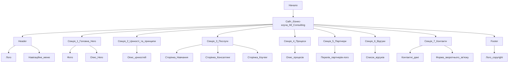

# Проєкт IM CONSULTING

## Опис проєкту

Сайт-візитка для створення особистого бренду та залучення нових клієнтів та партнерів.

- **Назва проєкту**: IM CONSULTING
- **Замовник проєкту**: Ілля Мушковський, бізнес тренер, топ консультант, антикризовий менеджер, коуч.

## Мета проєкту

- Створення позитивного іміджу особистого бренду.
- Інформування клієнтів.
- Залучення клієнтів / партнерів.
- Отримання зворотного зв'язку від клієнтів.

## Цільова аудиторія

- **Вікова категорія**: Від 20 до 65.
- **Рівень доходів**: Середній, високий.

## Обсяг продукту

Багатосторінковий сайт-візитка для створення позитивного іміджу особистого бренду, інформування клієнтів, залучення клієнтів / партнерів та отримання зворотного зв'язку від клієнтів.

## Технічний стек

**Front-end:**

- Next.js
- CSS framework: Tailwind

## Доступність

- Інтуїтивно зрозумілий дизайн.
- Зручний для мобільних пристроїв.
- Веб-ресурс доступний для будь-якого підключення до Інтернету.

## Безпека

- SSL-з'єднання.
- Відсутність публічного доступу для приватних компонентів системи.
- Перевірка основних типів атак (sqli, xss тощо).
- Усі паролі мають бути хешованими.
- Доступ користувача через сесії.

## Мови, що підтримуються

- Українська

## Структура сайту

Here is a simple flow chart:

